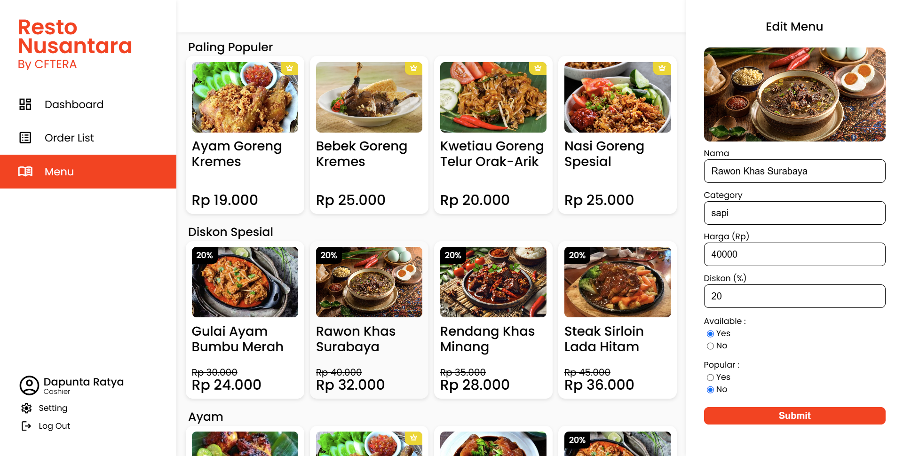

# CFTERA

<span style="font-size:18px; line-height:1; font-weight:500;">
CFTERA is a website-based ordering and cashier application that helps restaurant owners to simplify their service. In this example, <b>CFTERA</b> works for a restaurant called <b>Resto Nusantara</b>
</span>

<br>

# Interface

## A. Client

<table style="border-collapse: collapse; width: 100%; max-width: 800px; table-layout: fixed;">
    <tr>
        <td style="border: 1px solid transparent; padding: 5px; text-align: center;">
            
        </td>
        <td style="border: 1px solid transparent; padding: 5px; text-align: center;">
            
        </td>
        <td style="border: 1px solid transparent; padding: 5px; text-align: center;">
            
        </td>
    </tr>
</table>

## B. Admin

<table style="border-collapse: collapse; width: 100%; max-width: 800px; table-layout: fixed;">
    
    
    
</table>

# Installation

## A. Prepare MySQL (Database)

- You can use **MySQL Server** or **XAMPP**

- Set your own database in `cftera/backend/database/mysql_config.json`
    ```json
    {
        "host"     : "your_localhost",
        "user"     : "your_user",
        "password" : "your_password",
        "database" : "your_schema",
        "port"     : "your_port",
        "charset"  : "utf8mb4"
    }
    ```

- Create relational database step by step with [database settings](https://github.com/marghozy/Tugas/blob/main/CFTERA/backend/database/README.md)

## B. Prepare Backend (FastAPI)

- Install all library from `/backend/python/requirements.txt`
    ```py
    pip install -r backend/python/requirements.txt --upgrade
    ```

- Set your own FastAPI configuration in `cftera/backend/python/main.py`
    ```py
    if __name__ == "__main__":
        uvicorn.run(
            "main:app",
            host="127.0.0.1",
            port=3003,
            log_level="debug",
            reload=True
        )
    ```

## C. Prepare Frontend (Javascript)

- Change API on your frontend side, based on your backend config
    ```js
    const api ='http://127.0.0.1:3003';
    ```

## D. How To Run

- Open Project  
    Open folder `cftera` in VSCode

- Open Command Prompt in Administrator Mode  *(if you use MySQL Server)*  
    - Start MySQL Server *(if you want to start)*
        ```sh
        net start MySQL80
        ```
    - Stop MySQL Server *(if you want to stop)*
        ```sh
        net stop MySQL80
        ```

- Open XAMPP and start MySQL *(if you use XAMPP)*

- Start Backend **FastAPI**
    - Run `main.py` in VSCode Terminal  
    - And URL will be served

